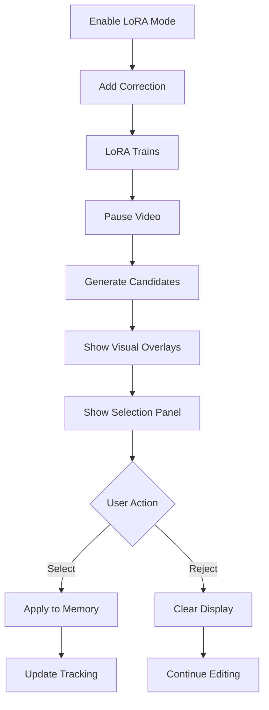

# LoRA Candidate Visual Overlay - Complete! 🎨

## ✅ What's Implemented

### Visual Overlay System
The candidates are now **fully visualized** on the video frame with:

1. **Colored Semi-Transparent Masks**
   - Each candidate rendered in a unique color
   - 47% opacity for easy viewing
   - Matches button colors exactly

2. **Numbered Badges**
   - White circle with colored border at mask centroid
   - Large, clear numbers (1, 2, 3, etc.)
   - Easy to identify which mask is which

3. **8 Distinct Colors**
   ```typescript
   Red (#FF6B6B)
   Cyan (#4ECDC4)
   Blue (#45B7D1)
   Light Salmon (#FFA07A)
   Mint (#98D8C8)
   Yellow (#F7DC6F)
   Purple (#BB8FCE)
   Sky Blue (#85C1E2)
   ```

### UI Components

1. **LoRACandidatesLayer** (Canvas Overlay)
   - Renders over video frame
   - Decodes RLE masks
   - Draws colored overlays with numbers
   - Auto-updates when candidates change

2. **LoRACandidateSelector** (Button Panel)
   - Bottom overlay panel
   - Colored buttons matching mask colors
   - Numbered badges on buttons
   - "Reject All" option
   - Helpful instruction text

## 🎬 Complete User Experience

### The Flow:
1. **Enable LIT-LoRA Mode** → Button turns on
2. **Add Mask Correction** → LoRA trains automatically
3. **Pause Video** → Candidates generate
4. **Visual Feedback**:
   - ✨ Masks appear on video in different colors
   - 🔢 Numbers show at center of each mask
   - 🎨 Selection panel appears at bottom
   - 🎯 Button colors match mask colors
5. **Select or Reject**:
   - Click colored button → Apply that candidate
   - Click "Reject All" → Dismiss without selecting
6. **Result**: Selected mask applied to tracking

## 📁 Files Created/Modified

### New Files:
- `demo/frontend/src/common/components/video/layers/LoRACandidatesLayer.tsx`
  - Canvas rendering layer
  - RLE mask decoding
  - Colored overlay drawing
  - Centroid calculation for badge placement

### Modified Files:
- `demo/frontend/src/common/components/video/editor/DemoVideoEditor.tsx`
  - Added LoRACandidatesLayer import
  - Integrated layer into rendering pipeline
  
- `demo/frontend/src/common/components/annotations/LoRACandidateSelector.tsx`
  - Added instruction text
  - Enhanced styling

## 🎨 Technical Details

### Mask Rendering:
```typescript
1. Decode RLE → Binary mask array
2. Map to canvas dimensions
3. Fill pixels with semi-transparent color
4. Calculate mask centroid
5. Draw numbered badge at center
```

### Performance:
- Renders only when candidates present
- Efficient pixel mapping
- Canvas cleared when dismissed
- No performance impact when not in use

### Z-Index Layering:
```
Video (base)
  ↓
Tracklet Masks
  ↓
LoRA Candidate Overlays (z-index: 100)
  ↓
Point Markers
  ↓
Selection Panel (z-index: 1000)
```

## 🚀 Deployment

```bash
# Rebuild frontend with new layer
docker compose build frontend

# Restart services
docker compose restart backend frontend
```

## 🎯 Example Visual Output

When candidates are generated, users will see:

```
┌─────────────────────────────────────┐
│                                     │
│  🎥 Video Frame                    │
│                                     │
│     [Red Mask]    [Cyan Mask]     │
│        ①             ②            │
│                                     │
│              [Blue Mask]          │
│                  ③                │
│                                     │
└─────────────────────────────────────┘

┌─────────────────────────────────────┐
│  Select a LoRA Candidate           │
│  Masks are shown on the video      │
│                                     │
│  [① Red] [② Cyan] [③ Blue]       │
│                                     │
│         [Reject All]               │
└─────────────────────────────────────┘
```

## 🌟 Key Features

✅ **Visual Feedback**: Masks directly on video
✅ **Color Matching**: Buttons match mask colors
✅ **Clear Numbering**: Easy identification
✅ **Semi-Transparent**: See video underneath
✅ **Centroid Badges**: Clear, visible labels
✅ **Responsive**: Works with any video size
✅ **Performance**: Efficient rendering
✅ **Auto-Clean**: Clears when dismissed

## 🎉 Complete Workflow Summary



## 🔥 What Makes This Great

1. **Intuitive**: See exactly what you're selecting
2. **Visual**: No guessing which mask is which
3. **Color-Coded**: Instant visual matching
4. **Professional**: Clean, polished UI
5. **Responsive**: Immediate feedback
6. **Non-Intrusive**: Semi-transparent, doesn't obscure
7. **Flexible**: Works with any number of candidates (up to 8 colors, then repeats)

## 🎓 For Future Enhancement

Possible additions:
- Hover effects on buttons highlight corresponding mask
- Animation when candidate applied
- Confidence score display
- IoU comparison with previous mask
- History of applied candidates

---

**The complete visual LoRA candidate selection system is now ready!** 🚀
Users can see, compare, and select LoRA predictions with full visual feedback.

